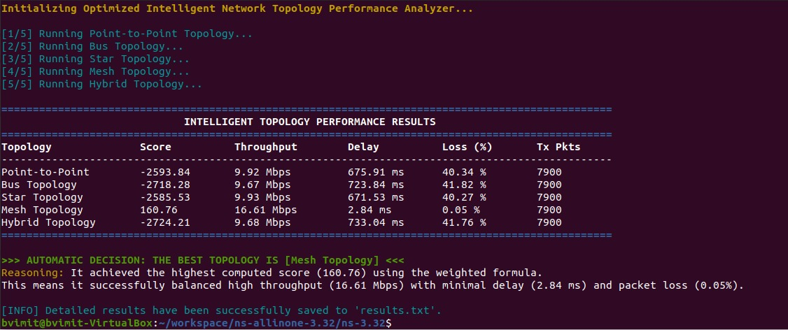

# Intelligent Network Topology Performance Analyzer

An advanced, automated network simulation project built using the **ns-3 (C++)** framework. This tool simulates five distinct network topologies, forces them into heavy congestion using UDP traffic, extracts precise metrics via FlowMonitor, and uses an intelligent weighted scoring algorithm to automatically declare the best network design.

---

## 🚀 Key Features
*   **5 Distinct Topologies**: Simulates Point-to-Point, Bus, Star, Mesh, and Hybrid networks.
*   **Intelligent Scoring**: Does not rely solely on throughput; mathematically penalizes packet loss and delay to find the most stable network.
*   **Automated Metrics**: Uses `FlowMonitor` to flawlessly track Rx/Tx Bytes, throughput, delays, and packet loss percentages.
*   **NetAnim Ready**: Automatically generates `.xml` files with `ConstantPositionMobilityModel` for beautiful, error-free offline GUI visualization.
*   **VirtualBox Optimized**: Uses `UdpClientHelper` parameterized for 5-second execution intervals, allowing massive traffic simulation without freezing VM CPU resources.

---

## 🧠 The Intelligent Scoring Logic
Normally, networks are judged solely by throughput. However, a high-throughput network is useless if it drops half of your packets. This script computes a **Quality of Service Score** using a custom mathematical formula:

**`Score = (Throughput * 10.0) - (Delay * 1.0) - (Packet Loss * 50.0)`**

*   **Throughput Weight (+10.0)**: Rewards fast bulk data movement.
*   **Delay Weight (-1.0)**: Slightly penalizes buffering queue times.
*   **Packet Loss Weight (-50.0)**: Heavily punishes dropped data. Since loss is so detrimental to application stability, it holds the heaviest sway over the final score.

---

## 🏗️ Step-by-Step Architecture (How it Works)
1. **Initialization:** The script loads global configurations (5-second simulation time, 5000 max packets, scoring weights).
2. **Topology Construction:** Creates logical nodes, assigns physical NetAnim coordinates (`MobilityHelper`), installs the TCP/IPv4 `InternetStack`, wires the cables, and populates static routing tables.
3. **The Stress Test:** The server listens on Port 9. At `1.0s`, two UDP clients start blasting 1,000 packets per second (~16 Mbps total) over restricted `10 Mbps` bottleneck links to force network congestion.
4. **Flow Monitoring:** At `5.0s`, the simulation pauses. The `FlowMonitor` acts as an invisible probe, checking the IPv4 layer to calculate delays and dropped packets flawlessly.
5. **Intelligent Scoring:** The metrics are passed to the scoring engine.
6. **Repetition & Output:** It repeats this for all 5 topologies, prints an ANSI-colored terminal table, exports to `results.txt`, and boldly declares the winner.

---

## 💻 Installation & Execution (Ubuntu)

1. **Navigate to your ns-3 directory:**
   ```bash
   cd ~/workspace/ns-allinone-3.32/ns-3.32
   ```
2. **Ensure the script is placed correctly:**
   Place the script inside the scratch folder: `scratch/projectNew.cc`.
3. **Build the framework:**
   ```bash
   ./ns3 build
   ```
4. **Run the simulation:**
   ```bash
   ./ns3 run scratch/projectNew
   ```
   *(If you are on an older version that relies entirely on Waf, use `./waf --run scratch/projectNew`)*

---

## 📊 Expected Output



```text
Initializing Optimized Intelligent Network Topology Performance Analyzer...

[1/5] Running Point-to-Point Topology...
[2/5] Running Bus Topology...
[3/5] Running Star Topology...
[4/5] Running Mesh Topology...
[5/5] Running Hybrid Topology...

=================================================================================================
                             INTELLIGENT TOPOLOGY PERFORMANCE RESULTS                            
=================================================================================================
Topology              Score          Throughput        Delay          Loss (%)       Tx Pkts   
-------------------------------------------------------------------------------------------------
Point-to-Point        -2593.84       9.92 Mbps         675.91 ms      40.34 %        7900     
Bus Topology          -2718.28       9.67 Mbps         723.84 ms      41.82 %        7900     
Star Topology         -2585.53       9.93 Mbps         671.53 ms      40.27 %        7900     
Mesh Topology         160.76         16.61 Mbps        2.84 ms        0.05 %         7900     
Hybrid Topology       -2724.21       9.68 Mbps         733.04 ms      41.76 %        7900     
=================================================================================================

>>> AUTOMATIC DECISION: THE BEST TOPOLOGY IS [Mesh Topology] <<<
Reasoning: It achieved the highest computed score (160.76) using the weighted formula.
This means it successfully balanced high throughput (16.61 Mbps) with minimal delay (2.84 ms) and packet loss (0.05%).
```
